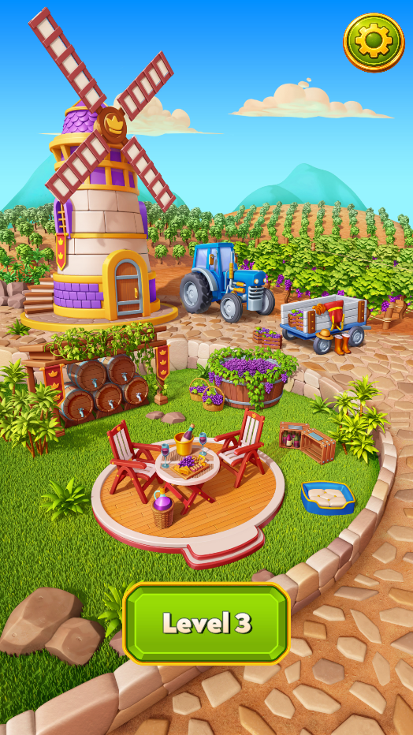
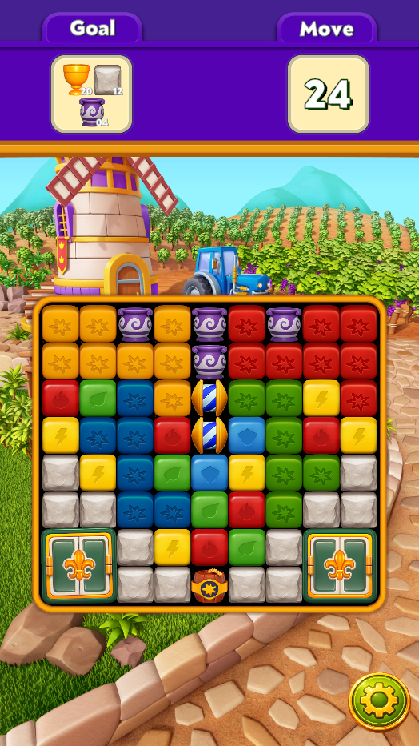
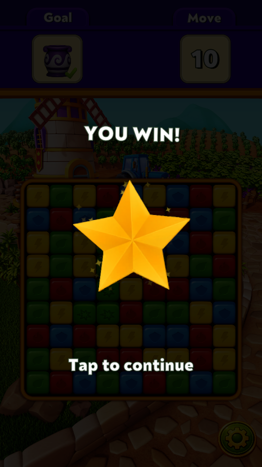
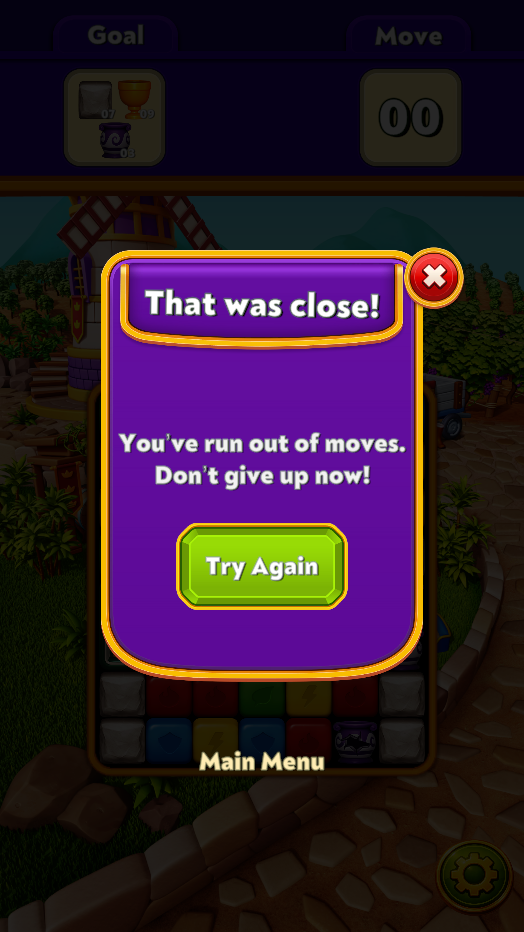
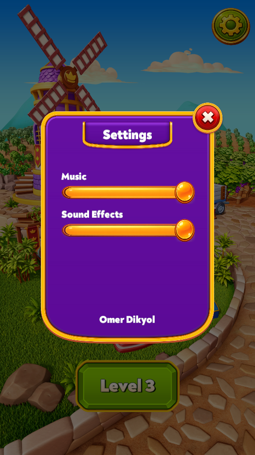

# DreamBlastClone - Omer Dikyol

DreamBlastClone is a level-based blast puzzle game built in Unity as a software engineering case study for Dream Games. The project focuses on deterministic gameplay, clean separation of concerns, testable pure C# game logic, and a presentation layer that is clearly separated from runtime board state.

The result is a fully playable 10-level puzzle game with authored JSON levels, progression, audio, haptics, particles, tween animation, popup flows, and a broad set of Edit Mode tests.

---

## Screenshots

### Main Scene


### Level Scene


### Win Popup


### Lose Popup


### Audio Settings Popup


---

## Tech Stack / Tools

- **Unity**: `6000.3.10f1`
- **Language**: C#
- **Rendering**: 2D, Built-in Renderer
- **Input**: Unity Input System
- **UI**: uGUI + TextMesh Pro
- **Animation / Tweening**: DOTween
- **Testing**: Unity Test Framework, Edit Mode tests
- **Persistence**: `PlayerPrefs`
- **Audio**: `AudioSource`-based music and SFX playback through a shared game audio controller
- **Haptics**:
  - iOS native bridge via `Assets/Plugins/iOS/DreamBlastCloneHaptics.mm`
  - Android vibrator backend
  - no-op fallback in unsupported/editor environments
- **Assembly Definitions**: project split into multiple assemblies to keep gameplay, data, controllers, views, and tests separated

---

## Scene Flow

### MainScene

MainScene is the player-facing entry point.

It:
- reads the stored current level from `CurrentLevelStore`
- displays the current playable level, or a finished state when all levels are completed
- plays menu music
- provides a Play button
- provides a settings button that opens the shared audio settings popup

### LevelScene

LevelScene:
- loads the current level JSON from the level catalog
- parses the authored level definition
- creates a deterministic runtime board
- initializes a `LevelSession`
- renders the board and HUD
- handles gameplay input, feedback, win, lose, retry, and progression return flow

### Win Flow

When the level is won:
- the board is blocked from further gameplay input
- the win presentation/popup is shown
- progression advances exactly once
- the player continues back to MainScene

### Lose Flow

When the level is lost:
- the lose popup is shown
- the player can retry the same level
- or return to MainScene

### Settings Flow

A shared audio settings popup exists in both scenes and exposes:
- Music volume
- SFX volume

Values are persisted and reapplied across scene changes.

---

## Architecture Overview

The key architectural rule is:

**Unity scene objects are not the source of truth for gameplay.**

All gameplay state lives in pure C# runtime data structures. Unity objects are responsible for:
- scene wiring
- input translation
- rendering
- animation
- audio / haptics
- popup and flow presentation

This split keeps gameplay deterministic and testable, while allowing the view layer to animate freely.

### Layers

#### Core
Shared primitives and enums, including board coordinates and shared board/item concepts.

#### Grid / Items / Obstacles
Runtime board data structures:
- `BoardModel`
- `CellModel`
- item models
- obstacle models

Cells keep **item** and **obstacle** layers separately.

#### Data
Authored level definitions, JSON parsing, level validation, board building, and level catalog data.

#### Systems
Pure gameplay rules:
- group detection
- blasts
- special-item activation
- combo resolution
- obstacle damage
- gravity
- refill
- move spending
- goal evaluation
- level state evaluation
- hints

#### Controllers
Pure C# orchestration around the session:
- session state
- tap processing
- level state progression
- current board state ownership

#### Controllers/Unity
Scene glue and runtime integration:
- scene bootstrap
- board input bridge
- main menu / level flow
- popups
- HUD updates
- audio
- haptics
- settings
- progression persistence

#### Views
Presentation-only layer:
- board rendering
- particles
- destruction feedback
- settle motion
- idle loops
- anticipation / hit reactions
- popup presentation
- special-item presentation
- background sizing / placement

#### Tests
Edit Mode tests target both pure gameplay systems and a large amount of presentation-support logic.

### Why the split matters

This separation gives three major benefits:

1. **Gameplay rules are testable without a running scene**
2. **Animation timing does not affect correctness**
3. **The board state remains the single source of truth**

Input goes in, pure gameplay resolves immediately, then the presentation layer reacts to the result.

---

## Folder Structure

```text
Assets/
├── Audio/                         Music and SFX clips
├── DOTween/                       DOTween library
├── Plugins/
│   └── iOS/                       Native iOS haptics bridge
├── Resources/                     Shared runtime assets such as GameAudioBank
├── Scenes/
│   ├── MainScene.unity
│   └── LevelScene.unity
├── Prefabs/                       Board item, obstacle, popup, and shared UI prefabs
├── Scripts/
│   ├── Core/                      Shared primitives and enums
│   ├── Grid/                      BoardModel, CellModel
│   ├── Items/                     Cube, Rocket, TNT runtime item models
│   ├── Obstacles/                 Vase, Stone, Chalice Box runtime obstacle models
│   ├── Data/                      Level definitions, JSON parser, board builder
│   ├── Systems/                   Pure gameplay logic
│   ├── Controllers/               Pure C# session orchestration
│   ├── Controllers/Unity/         Scene glue, flow, HUD, audio, haptics, settings
│   └── Views/                     Rendering, particles, tween animation, popups
├── Tests/
│   └── EditMode/                  Edit Mode test suite
├── CaseStudyAssets2026/           Provided game assets and authored level content (gitignored)
└── GameContent/                   Project content such as UI assets and levels
````

---

## Implemented Gameplay Features

### Level Loading

Levels are authored in JSON and loaded through a level catalog.

The pipeline is:

1. load level JSON
2. parse and validate authored data
3. normalize obstacle definitions where needed
4. build a deterministic runtime board

Supported authored content includes:

* colored cubes
* random cubes
* Rockets
* TNT
* Vase
* Stone
* Chalice Box parts

### Normal Cube Blasts

A tap on a valid cube group:

* detects orthogonally connected cubes of the same color
* requires a minimum group size of 2
* removes the group
* may create a special item depending on group size

### Rocket and TNT Creation

* group of exactly 4 creates a Rocket
* group of 6 or more creates a TNT
* Rocket orientation is derived from the detected group footprint

### Rocket

Rocket clears:

* a full row, or
* a full column

depending on its orientation.

### TNT

TNT clears a 5×5 area centered on the activation cell.

### Combos

Adjacent special-item taps trigger combo logic rather than single-special logic.

Implemented combos:

* Rocket + Rocket
* TNT + TNT
* TNT + Rocket

### Triggered Special Chains

Specials hit by another special’s footprint are snapshotted and then activated as triggered special chains.

These are resolved as chained single-special activations rather than recursive adjacent-combo logic.

### Obstacles

#### Vase

* takes damage from adjacent normal blasts and special footprints
* falls under gravity

#### Stone

* takes damage only from special footprints
* does not fall

#### Chalice Box

* a 2×2 obstacle with Door phase and Chalice phase
* door opens on hit
* chalice collection progresses after door phase
* chalice completion clears the obstacle

### Gravity and Refill

Gravity is resolved in pure code.

Implemented behavior includes:

* normal falling
* refill after gravity stabilizes
* lateral settling around rigid blockers where appropriate
* Vase participating in gravity as a falling obstacle
* Stone and Chalice Box remaining non-falling blockers

### Move Spending

Only valid actions spend a move:

* valid cube group tap
* valid special activation

Invalid taps do not consume moves.

### Goal Tracking

Goal evaluation is based on the current runtime board state and authored level configuration.

### Win / Lose

* **Win**: all required goals are cleared
* **Lose**: moves reach zero before all goals are cleared

### Progression

Progression is stored with `PlayerPrefs` and advanced on win.

### Hint System

A move hint system exists that:

* waits for inactivity
* finds a strong available move
* highlights it subtly

The ranking prefers stronger moves such as:

* TNT creation
* Rocket creation
* goal-advancing moves
* larger groups

---

## Implemented Presentation / Polish Features

### Board Rendering

* runtime board rendering from logical board state
* item and obstacle prefabs
* stable board placement across different level sizes
* responsive board background sizing
* board clipping/masking support where needed

### Layout / Camera

* stable board placement for varying level dimensions
* responsive orthographic camera behavior for different device ratios
* safe-area-aware UI handling where needed

### Level Intro

* level-start presentation sequence
* board reveal
* board content entrance
* HUD/top-bar entrance

### Destruction Feedback

* transient destruction copies
* scale/fade pop feedback before settle

### Settle Motion

* animated fall and refill motion
* landing feel / settle feedback
* obstacle settle support where needed

### Rocket / TNT / Combo Presentation

* Rocket split/travel presentation
* TNT activation presentation
* combo presentation for supported special-item combinations
* triggered special-chain presentation support

### Idle Loops

* subtle idle motion for cubes
* distinct idle motion for Rockets
* distinct idle motion for TNT
* idle pulse on MainScene button

### Tap Anticipation / Hit Reactions

* valid tap anticipation
* invalid tap feedback
* obstacle hit reactions
* Chalice Box state-specific tween feedback
* Stone destruction tween feedback

### Particles

Implemented particle/effect layers include:

* cube blast particles
* Rocket particles
* TNT particles
* Vase particles
* Stone particles
* Chalice Box particles
* win celebration particles

### Win / Lose / Popup Presentation

* win popup/presentation
* lose popup
* popup open/close lifecycle animation
* popup button polish
* settings popup

### Audio Settings Popup

* shared popup in MainScene and LevelScene
* music volume slider
* SFX volume slider
* persistent settings

---

## Audio / Feedback

### Music

* main menu background music
* gameplay background music

### SFX

Implemented SFX coverage includes:

* menu/button click
* popup open/close
* cube blast
* Rocket activation
* TNT activation
* Vase hit / destroy
* Stone destroy
* Chalice Box door hit / break / chalice collect
* goal completion
* win sting
* lose sting

### Audio System

The project includes:

* a shared audio bank
* pooled SFX playback
* per-cue cooldown / anti-spam handling
* music and SFX volume separation
* settings persistence

### Haptics

A first-pass haptics system exists with:

* Light
* Medium
* Heavy

Triggers are mapped to gameplay and UI events while using cooldowns / override rules to avoid haptic spam.

---

## Testing / Validation

The project includes a broad Edit Mode test suite covering:

* board model behavior
* gameplay systems
* level/session flow
* parsing and board building
* hint resolution
* audio/haptics support logic
* popup and controller behavior
* many presentation-support descriptor/player paths

Manual runtime validation was also used for:

* gameplay feel
* popup sequencing
* obstacle edge cases
* gravity/blocker behavior
* chained special activations
* progression and scene flow

---

## How To Open / Run

1. Open the project in Unity Hub
2. Use **Unity 6000.3.10f1**
3. Let the project import packages and assets
4. Open `Assets/Scenes/MainScene.unity`
5. Press Play

### Entry Point

`MainScene` is the intended entry point.

### Levels

Authored level content is loaded through the level catalog and current-level persistence.

### Tests

Open **Unity Test Runner** and run the Edit Mode suite.

---

## Known Limitations / Future Improvements

* final tuning of motion/audio/haptics may still benefit from more device-specific balancing
* automated Play Mode / device validation is lighter than the Edit Mode test coverage
* some polish systems could still be tuned further for exact feel
* the hint system is intentionally subtle and practical rather than a full hint-AI framework
